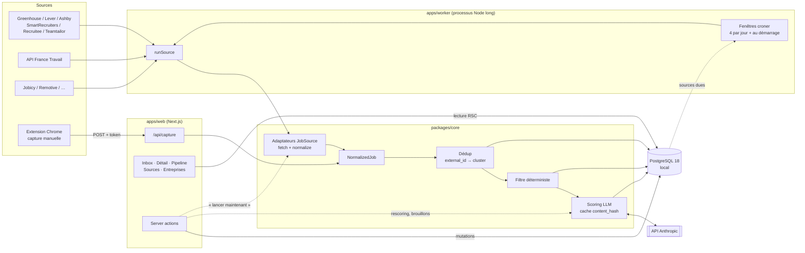
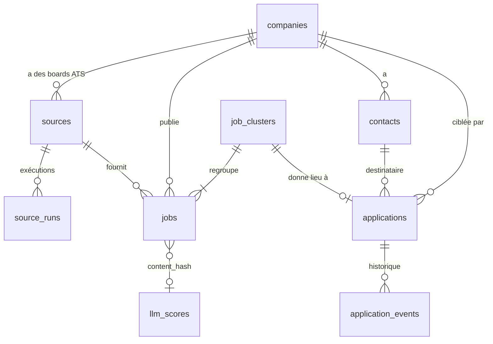

# JobHunt — Plan technique

> Rédigé le 2026-09-17. Les versions citées ont été vérifiées ce jour-là (voir [STACK.md](STACK.md)). Les affirmations sur les APIs externes sont sourcées dans [SOURCES.md](SOURCES.md) ; ce qui n'a pas pu être vérifié y est marqué `[À VÉRIFIER]`.

---

## 1. Vision et périmètre

### Ce que c'est

Un outil **personnel, mono-utilisateur, local**, qui sert à une seule chose : trouver et suivre un **CDI full remote en France** de développeur front-end React/Next.js ou fullstack JS/TS. Il est utilisé tous les jours pendant la recherche, puis abandonné sans regret.

Critère de succès : **en 10 minutes par jour, Robin voit les nouvelles offres pertinentes, triées, et sait quelles candidatures relancer.**

### Arbitrages de cadrage (validés avec Robin)

| Sujet | Décision |
|---|---|
| Zone | France uniquement : CDI de droit français, ou employeur ayant une entité en France. Les offres « US only », « contractor », « EOR » et celles qui imposent un fuseau hors CET sont rejetées ou signalées. |
| Capture manuelle | Extension Chrome MV3 minimale, chargée en mode non empaqueté. Un bookmarklet s'exécuterait sous la CSP de la page ; celle de LinkedIn bloquerait le `fetch` vers l'API locale. |
| Hébergement | **Tout en local** : app, worker et base. L'outil tourne quand le PC est allumé ; il est éteint le soir et la nuit, et le worker rattrape au démarrage. Pas d'authentification ; l'app écoute sur `127.0.0.1`. |
| Base | **PostgreSQL 18 natif sous Windows** (winget), sans Docker ([ADR-008](ADR/008-postgres-local.md)). |
| Module B | Le brouillon est généré, puis envoyé **manuellement** depuis le client mail de Robin. Ni SMTP ni OAuth mail. |

### Hors périmètre, explicitement

- Scraping de LinkedIn, de Welcome to the Jungle, d'Indeed ou de tout site sans API ou flux public prévu pour ça.
- Envoi automatique d'emails, séquences de relance automatiques, tracking d'ouverture.
- Génération d'adresses nominatives par motif (`prenom.nom@`), achat ou enrichissement de bases de contacts.
- Multi-utilisateur, authentification, déploiement cloud, mobile (voir « Reporté volontairement » dans [ROADMAP.md](ROADMAP.md)).
- Génération automatique de CV ou de lettres pour les offres du module A. Le `hook` du scoring suffit ; la lettre s'écrit à la main.
- Tableaux de bord statistiques, graphiques, analytics.

### Avis franc sur le besoin

- **Le vrai levier du module A, c'est le registre d'entreprises ATS**, pas le code. Une douzaine d'adaptateurs ne sert à rien si le registre contient 8 boîtes. Prévois du temps de curation hebdomadaire (voir §6.6).
- **Le module B a un rendement incertain.** Une candidature spontanée vers `contact@` d'une boîte trouvée par code NAF marche mal. SIRENE renvoie surtout des ESN et des cabinets de conseil, c'est-à-dire la « régie » que Robin exclut. Le plan le place donc **en dernier**, et limite SIRENE à un rôle d'enrichissement plutôt que de découverte (§9).
- **Le « full remote » est mal balisé dans les annonces françaises.** Un filtre strict jetterait de bonnes offres. Le filtre déterministe ne rejette que les cas **explicites** ; les cas ambigus passent et c'est le LLM qui tranche. Une vue « rejetées » permet d'auditer les faux négatifs.
- **Coût LLM** : il se compte plutôt en **dizaines de centimes par semaine** qu'en quelques centimes (estimation au §7.6). C'est négligeable, mais autant avoir le bon ordre de grandeur.

---

## 2. Architecture générale



**Principe de communication** : l'app web et le worker ne se parlent jamais. Ils partagent seulement la base et `packages/core`. Le bouton « lancer maintenant » exécute `core.ingest.runSource()` **directement dans la server action**, sans passer par le worker. Il n'y a donc ni file de messages, ni RPC, ni Redis.

---

## 3. Découpage du code

```
jobhunt/
├─ apps/
│  ├─ web/          Next.js 16 (App Router) : UI, route handlers, server actions
│  ├─ worker/       Processus Node long : planification + exécution des sources + scoring
│  └─ extension/    Extension Chrome MV3, JS pur, aucun build
├─ packages/
│  └─ core/         Domaine : types, schémas zod, adaptateurs, normalisation, dédup, filtre, scoring, schéma DB
├─ profile/
│  ├─ cv.md         CV en Markdown, injecté dans les prompts
│  ├─ criteria.json Critères du filtre (regex), validés par zod et relus à chaud
│  └─ boards.json   Registre de départ (boards ATS + flux), importé par `seed-sources`
├─ pnpm-workspace.yaml
├─ biome.json
└─ docs/
```

Justification de chaque brique :

| Brique | Besoin concret |
|---|---|
| `apps/web` | L'interface de tri et le point d'entrée HTTP de l'extension. |
| `apps/worker` | Un polling planifié de dizaines de sources, qui ne peut pas vivre dans le cycle requête/réponse de Next. |
| `apps/extension` | Capturer une offre LinkedIn ou WTTJ sans scraping. |
| `packages/core` | La même logique (normalisation, filtre, scoring) sert au worker **et** à `/api/capture`. Il la faut testable sans HTTP. |
| `profile/` | Le CV et les critères évoluent pendant la recherche ; ce sont des données versionnées, pas du code métier. |

Pas de `packages/db`, `packages/ui` ni `packages/config` séparés : aucun besoin constaté. Le schéma Drizzle vit dans `core/src/db`.

### 3.1 Frontières exactes

| Qui | A le droit de | N'a pas le droit de |
|---|---|---|
| `packages/core` | Contenir **toute** la logique métier. Faire des I/O **seulement** dans `src/sources/*` (fetch), `src/db/*` (Postgres), `src/scoring/*` et `src/outreach/*` (Anthropic), `src/contacts/*` (fetch des sites, DNS). | Importer `next`, `react`, ou quoi que ce soit de `apps/*`. Lire `process.env` ailleurs que dans `src/env.ts`. |
| `apps/worker` | Planifier, choisir les sources dues, appeler `core.ingest.runSource()` puis `core.scoring.scorePending()`, journaliser. | Contenir une règle métier : pas de normalisation, pas de filtre, pas de SQL métier en dehors de `core`. |
| `apps/web` | Afficher (Server Components qui lisent via `core/db/queries`), muter via des server actions qui appellent `core`, exposer `/api/capture`. Déclencher ponctuellement, **via core**, une source (« tester ce board », « lancer maintenant » → `runSource`) ou le LLM (rescoring, brouillon). | Polling récurrent. Logique de parsing ou de filtre écrite dans un composant ou une action. |
| `apps/extension` | Lire la page active **sur clic de Robin** et la poster à `/api/capture`. | Parcourir des pages, cliquer, paginer, ou s'exécuter sans action de Robin. |

`packages/core` est consommé **sans étape de build** :

- par Next, via `transpilePackages: ['@jobhunt/core']` ;
- par le worker, via `tsx`.

Les exports passent par des sous-chemins dans `package.json#exports` : `@jobhunt/core/domain`, `/db`, `/sources`, `/ingest`, `/filter`, `/scoring`, `/outreach`, `/contacts`. Le code client de Next n'importe que `/domain`, qui contient les types et fonctions pures sans I/O (discipline vérifiée en revue : le paquet `server-only` n'est pas utilisé, car il lève une erreur hors du runtime React Server et casserait le worker).

---

## 4. Modèle de données

PostgreSQL 18 local, extensions `pg_trgm`, `pgcrypto` et `citext` (modules `contrib`). Le schéma est défini avec Drizzle (`packages/core/src/db/schema.ts`). Les colonnes sont en `snake_case`, les ids sont des `uuid` (sauf `sources.id`), et les horodatages des `timestamptz`.

### 4.1 Vue d'ensemble



### 4.2 Tables

**`companies`**

| Colonne | Type | Notes |
|---|---|---|
| id | uuid pk | |
| name | text | Nom d'affichage |
| name_norm | text | `normalizeCompanyName()` : minuscules, sans accents ni formes juridiques (SAS, SA, SARL, Inc, GmbH…) |
| domain | text null | Domaine du site (`doctolib.fr`), unique quand il est renseigné |
| website | text null | |
| siren | char(9) null | Unique quand renseigné |
| naf_code | text null | Code NAF (rév. 2) ; colonne `naf25_code` à prévoir, voir SOURCES |
| headcount_range | text null | Code de tranche d'effectif INSEE |
| tags | text[] | Libre : `remote-first`, `fintech`, `vu-sur-X`… |
| outreach_status | enum | `none`, `to_contact`, `contacted`, `replied`, `closed` (module B) |
| notes | text | |
| source | text | Provenance de la fiche : `ats_registry`, `job:<source_id>`, `recherche_entreprises`, `manual` |
| created_at / updated_at | timestamptz | |

Index : `unique(domain) where domain is not null`, `unique(siren) where siren is not null`, `index(name_norm)`, `gin(name_norm gin_trgm_ops)`.

**`sources`** : le registre des sources **et** des boards ATS, dans une seule table.

| Colonne | Type | Notes |
|---|---|---|
| id | text pk | Lisible : `greenhouse:doctolib`, `france_travail:react-cdi`, `jobicy`, `capture` |
| kind | enum | `greenhouse`, `lever`, `ashby`, `smartrecruiters`, `recruitee`, `teamtailor`, `workable`, `france_travail`, `jobicy`, `remotive`, `capture` |
| company_id | uuid null fk | Renseigné pour les boards ATS |
| config | jsonb | Validé par `adapter.configSchema` (ex. `{ token: "doctolib" }`, `{ region: "eu" }`, `{ motsCles: "react", typeContrat: "CDI" }`) |
| enabled | bool | |
| interval_minutes | int | Borné en bas par `adapter.minIntervalMinutes` |
| next_run_at | timestamptz | Le bouton « lancer maintenant » met `now()` |
| last_run_at / last_success_at | timestamptz null | |
| consecutive_failures | int | |
| last_error | text null | |
| cursor | jsonb null | État incrémental propre à l'adaptateur |
| running_since | timestamptz null | Verrou de run (worker ou « lancer maintenant ») ; considéré comme expiré après 30 min |
| created_at | timestamptz | |

Index : `index(enabled, next_run_at)`.

**`source_runs`** : journal des exécutions, pour diagnostiquer une panne.

`id`, `source_id` fk, `started_at`, `finished_at`, `status` (`ok` | `partial` | `failed`), `fetched`, `created`, `updated`, `closed`, `error` (text), `http_calls`.

Index : `(source_id, started_at desc)`. Purge des lignes de plus de 60 jours au démarrage du worker.

**`jobs`** : une ligne par annonce **par source**.

| Colonne | Type | Notes |
|---|---|---|
| id | uuid pk | |
| source_id | text fk | |
| external_id | text | Id natif (Greenhouse `id`, FT `id`, capture : `sha256(url canonique)`) |
| cluster_id | uuid fk | Jamais null après ingestion |
| company_id | uuid null fk | |
| company_name_raw | text null | FT peut ne pas le fournir |
| title | text | |
| title_norm | text | `normalizeTitle()` : sans « H/F », « (F/H) », « - CDI », ponctuation ni accents |
| url | text | URL de l'annonce |
| apply_url | text null | |
| location_raw | text null | |
| country_code | char(2) null | |
| remote_policy | enum | `full_remote`, `hybrid`, `onsite`, `unknown` |
| remote_scope | enum | `france`, `europe`, `worldwide`, `other`, `unknown` |
| contract_type | enum | `cdi`, `cdd`, `freelance`, `internship`, `apprenticeship`, `other`, `unknown` |
| seniority | enum | `junior`, `mid`, `senior`, `lead`, `unknown` |
| salary_min / salary_max | int null | Brut annuel en euros quand c'est convertible ; sinon null, et le texte brut est gardé |
| salary_raw | text null | |
| description_text | text | Texte brut, HTML nettoyé |
| tags | text[] | Tags fournis par la source |
| published_at | timestamptz null | |
| source_updated_at | timestamptz null | |
| first_seen_at / last_seen_at | timestamptz | |
| closed_at | timestamptz null | Mis quand l'annonce disparaît d'un listing complet |
| content_hash | char(64) | Voir §5.2 |
| filter_status | enum | `pending`, `passed`, `rejected` |
| filter_reasons | text[] | Codes lisibles : `contract:internship`, `remote:hybrid_explicit`, `stack:none`… |
| rule_score | int | Pré-score déterministe de 0 à 100 (tri avant le LLM) |
| raw | jsonb | Payload source intact, pour renormaliser sans refetch |
| created_at / updated_at | timestamptz | |

Index :
- `unique(source_id, external_id)` ;
- `index(cluster_id)` ;
- `index(content_hash)` ;
- `index(filter_status, first_seen_at desc)` ;
- `gin(title_norm gin_trgm_ops)` ;
- `index(company_id, last_seen_at desc)`.

**`job_clusters`** : l'« offre » telle que Robin la voit, toutes sources confondues. C'est l'unité de tri de l'UI.

| Colonne | Type | Notes |
|---|---|---|
| id | uuid pk | |
| canonical_job_id | uuid fk | L'annonce affichée par défaut (priorité : ATS > capture > FT > agrégateurs) |
| company_id | uuid null fk | |
| dedup_key | text | `company_norm|title_norm` |
| triage | enum | `new`, `interested`, `dismissed`, `applied` |
| triaged_at | timestamptz null | |
| best_score | int null | Dénormalisé depuis `llm_scores` pour trier |
| score_status | enum | `not_needed` (rejeté), `pending`, `done`, `failed` |
| first_seen_at / last_seen_at | timestamptz | |
| previous_cluster_id | uuid null | Republication d'une offre déjà vue et close (badge « déjà vue ») |

Index :
- `index(triage, best_score desc nulls last)` ;
- `index(dedup_key, last_seen_at desc)` ;
- `index(score_status)`.

**`llm_scores`** : le cache de scoring.

| Colonne | Type | Notes |
|---|---|---|
| id | uuid pk | |
| content_hash | char(64) | |
| prompt_version | text | `scoring.v1` |
| model | text | `claude-haiku-4-5` |
| status | enum | `ok`, `failed` |
| score | int null | |
| justification | text null | |
| matched_skills / missing_skills / red_flags | text[] | |
| hook | text null | |
| remote_verdict | enum null | Voir §7.3 |
| contract_verdict | enum null | |
| input_tokens / output_tokens | int | Suivi de coût |
| attempts | int | |
| error | text null | |
| created_at | timestamptz | |

Index : `unique(content_hash, prompt_version, model)`.

**`applications`** : le pipeline de candidature, commun aux modules A et B.

| Colonne | Type | Notes |
|---|---|---|
| id | uuid pk | |
| kind | enum | `job` (module A), `spontaneous` (module B) |
| cluster_id | uuid null fk | Si `kind = job` : `cluster_id` **ou** `external_url` obligatoire (contrainte CHECK). Couvre les candidatures faites hors outil. |
| external_url / external_title | text null | Candidature saisie à la main, sans offre ingérée |
| company_id | uuid null fk | Obligatoire si `kind = spontaneous` |
| contact_id | uuid null fk | Destinataire (module B) |
| status | enum | `to_apply`, `applied`, `followed_up`, `interview`, `offer`, `rejected`, `withdrawn`, `ghosted` |
| applied_at | timestamptz null | |
| next_action_at | date null | Relance calculée (+7 j après candidature, +10 j après relance), modifiable |
| channel | text null | `ats`, `email`, `linkedin`, `referral` |
| draft_subject / draft_body | text null | Brouillon du module B |
| notes | text | |
| created_at / updated_at | timestamptz | |

Index :
- `unique(cluster_id) where cluster_id is not null` ;
- `index(status, next_action_at)`.

**`application_events`** : l'historique.

`id`, `application_id` fk (cascade), `type` (`status_change` | `note` | `sent` | `follow_up` | `interview_scheduled`), `from_status`, `to_status`, `note`, `occurred_at`.

**`contacts`** (module B) : les champs RGPD sont **obligatoires**.

| Colonne | Type | Notes |
|---|---|---|
| id | uuid pk | |
| company_id | uuid fk | |
| email | citext | |
| kind | enum | `generic` (jobs@, contact@…) ou `personal` (personne physique, **saisie manuelle uniquement**) |
| label | text null | « Page carrières », « Nom Prénom — CTO »… |
| source | text | `crawl:<url exacte>` ou `manual:<contexte>` |
| collected_at | timestamptz | |
| consent_basis | enum | `b2b_legitimate_interest` (générique), `legitimate_interest_candidate` (nominatif, contact unique lié à l'activité), `explicit_consent` |
| mx_valid | bool null | |
| mx_checked_at | timestamptz null | |
| info_notice_sent_at | timestamptz null | Mention d'information envoyée (obligatoire si `personal`) |
| opted_out_at | timestamptz null | Demande de ne plus être contacté |
| deleted_at | timestamptz null | Effacement logique. Une purge physique supprime `email` et `label` après 30 jours. |

Index : `unique(email) where deleted_at is null`, `index(company_id)`.

**`worker_heartbeat`** : une seule ligne (`id = 1`), avec `last_tick_at` (fin de la dernière fenêtre), `last_backup_at`, `started_at`, `version`, `scoring_enabled` et `last_scoring_error`.

**Colonnes ajoutées à l'implémentation** : `sources.label` (nom affiché), `jobs.filter_flags` (signalements non bloquants), `jobs.forced_pass` (repêchage manuel, conservé aux runs suivants), `job_clusters.closed_at`. L'UI s'en sert pour savoir si le worker tourne.

### 4.3 Normalisation multi-sources

Chaque adaptateur produit un `NormalizedJob`, défini par un schéma zod dans `core/src/domain/job.ts`. C'est **le seul contrat** entre les sources et le reste du système :

```ts
export const NormalizedJob = z.object({
  externalId: z.string().min(1),
  url: z.url(),
  applyUrl: z.url().nullable(),
  title: z.string().min(1),
  companyName: z.string().nullable(),
  locationRaw: z.string().nullable(),
  countryCode: z.string().length(2).nullable(),
  remotePolicy: RemotePolicy,      // 'full_remote' | 'hybrid' | 'onsite' | 'unknown'
  remoteScope: RemoteScope,
  contractType: ContractType,
  seniority: Seniority,
  salary: SalaryRange.nullable(),
  descriptionText: z.string(),
  tags: z.array(z.string()),
  publishedAt: z.date().nullable(),
  sourceUpdatedAt: z.date().nullable(),
  raw: z.unknown(),
});
```

Correspondances, par exemple :

| Champ cible | Greenhouse | Ashby | France Travail |
|---|---|---|---|
| externalId | `id` | `id` | `id` |
| title | `title` | `title` | `intitule` |
| companyName | `company_name` (sinon le nom du registre) | Nom du registre | `entreprise.nom` (souvent absent) |
| remotePolicy | Déduit de `location.name` + texte → souvent `unknown` | `workplaceType` / `isRemote` | Déduit du texte → souvent `unknown` `[À VÉRIFIER : champ télétravail]` |
| contractType | Déduit du texte → `unknown` | `employmentType` (`FullTime` ≠ CDI → `unknown` si hors France) | `typeContrat` (`CDI`, `CDD`, `MIS`…) |
| descriptionText | `content` (HTML échappé → décodé → texte) | `descriptionPlain` | `description` |
| publishedAt | `first_published` | `publishedAt` | `dateCreation` |
| sourceUpdatedAt | `updated_at` | — | `dateActualisation` |

Règles communes, dans `core/src/domain/normalize/*`, toutes pures et testées :

- `htmlToText()` : conversion HTML → texte via `linkedom`, avec les entités décodées.
- `detectRemote(text, structured)` : les champs structurés priment sur le texte. Motifs FR et EN :
  - `full_remote` : `full remote`, `100 % (télétravail|remote)`, `télétravail (total|complet)`, `remote-first`, `fully remote` ;
  - `hybrid` : `hybride`, `\d jours? (de télétravail|sur site|au bureau)`, `hybrid` ;
  - `onsite` : `sur site uniquement`, `pas de télétravail`.
  - Ambiguïté → `unknown`.
- `detectRemoteScope()` : `France` / `Remote - France` → `france` ; `EU` / `Europe` / `EMEA` / `CET` → `europe` ; `US only`, `must be located in the US`, `PST/EST` → `other`.
- `detectContract()` : `CDI` / `permanent` → `cdi` ; `stage` / `intern` → `internship` ; `alternance` / `apprenti` → `apprenticeship` ; `freelance` / `contractor` / `portage` / `mission` → `freelance`.
- `detectSeniority()` : sur le titre d'abord (`senior`, `sr`, `lead`, `staff`, `confirmé`, `junior`), puis sur le texte (`\d+ ans d'expérience`).
- `parseSalary()` : formats `45k-55k€`, `45 000 € - 55 000 €`, `Annuel de 45000 Euros à 55000 Euros` (format FT).

**Principe** : un adaptateur ne fait **que** du mapping de champs. Toute heuristique textuelle vit dans `normalize/*`, partagée par toutes les sources.

---

## 5. Déduplication

Détails et alternatives écartées : [ADR-003](ADR/003-deduplication.md).

### 5.1 Niveau 1 — même annonce, même source

`upsert` sur `(source_id, external_id)`. Si l'annonce existe déjà, on met à jour `last_seen_at`, puis :

- si `content_hash` a changé, on met à jour les champs et le cluster repasse en `score_status = pending` ;
- si l'annonce était close et réapparaît, on remet `closed_at = null`.

### 5.2 `content_hash`

`sha256(title_norm + "\n" + company_norm + "\n" + normalizeWhitespace(description_text))`

Il sert à deux choses : la clé du cache LLM et la détection de modification. Les champs volatils (dates, compteurs) sont exclus pour qu'un simple « rafraîchissement » de l'annonce ne relance pas le scoring.

### 5.3 Niveau 2 — même offre, sources différentes

Une nouvelle annonce (ou une annonce dont le `dedup_key` a changé) est rattachée à un cluster, dans cet ordre :

1. **Clé exacte** : un cluster avec le même `dedup_key = company_norm + "|" + title_norm` et `last_seen_at > now() - 45 jours` → rattachement.
2. **Similarité** : `company_id` identique (ou `company_norm` identique) **et** `similarity(title_norm) >= 0.75` (pg_trgm) sur la même fenêtre de 45 jours → rattachement, **à deux conditions** ajoutées après test sur 1 300 annonces réelles :
   - le cluster candidat ne contient encore aucune annonce **de la même source** (dans une source, deux identifiants distincts sont deux offres : « Customer Experience Representative – French/German speaker ») ;
   - les **qualificatifs** du titre coïncident (`titleQualifiers` : séniorité, langue, spécialité ; « Product Manager » ≠ « Senior Product Manager »).

   Le seuil et la fenêtre sont des constantes de `core/src/dedup/keys.ts`.
3. **Sinon** → nouveau cluster. Si un cluster fermé depuis plus de 45 jours a la même clé, on renseigne `previous_cluster_id` (badge « republiée »).

Si l'entreprise est inconnue (fréquent chez France Travail : « entreprise non communiquée »), **pas de rattachement inter-sources**, on accepte le doublon. L'UI propose une action « fusionner avec… » (§8) pour les cas manuels.

Le cluster garde la décision de tri de Robin : une offre écartée sur Greenhouse ne réapparaît pas via France Travail.

**Choix du `canonical_job_id`** : l'ATS de l'entreprise, puis la capture, puis France Travail, puis les agrégateurs. L'annonce de l'ATS est la plus complète et c'est celle où l'on postule.

---

## 6. Architecture d'ingestion

### 6.1 Interface commune

```ts
// packages/core/src/sources/types.ts
export interface JobSource<Config, Cursor = unknown> {
  kind: SourceKind;
  configSchema: z.ZodType<Config>;
  defaultIntervalMinutes: number;
  minIntervalMinutes: number;      // plancher imposé par les CGU / rate limits de la source
  /** true : le listing renvoyé est exhaustif → une annonce absente est close */
  completeListing: boolean;
  fetch(ctx: FetchContext<Config, Cursor>): Promise<FetchResult<Cursor>>;
  /** pure, testée sur fixtures */
  normalize(raw: unknown, ctx: NormalizeContext): NormalizedJob;
}

export interface FetchContext<Config, Cursor> {
  config: Config;
  cursor: Cursor | null;
  http: HttpClient;          // timeout, retry, User-Agent, throttle par hôte
  signal: AbortSignal;
  log: Logger;
}

export interface FetchResult<Cursor> {
  items: unknown[];          // payloads bruts
  nextCursor: Cursor | null;
  complete: boolean;         // false si pagination interrompue → ne rien clore
}
```

`fetch` fait les I/O et la pagination ; `normalize` est pure. Les fixtures JSON réelles (une par source) vivent dans `core/test/fixtures/<kind>/` et les tests de `normalize` tournent dessus.

### 6.2 Orchestration : `core/ingest/runSource(sourceId)`

1. Charger la source et valider `config` avec son adaptateur.
2. Créer une ligne `source_runs` (`started`).
3. Appeler `adapter.fetch()`.
4. Pour chaque item : `normalize` → `upsert job` → dédup/cluster → filtre (`filter_status`, `filter_reasons`, `rule_score`). Un item qui échoue à la normalisation est journalisé et ignoré ; le run passe alors en `partial`.
5. Si `completeListing && result.complete` : `closed_at = now()` sur les annonces de la source non vues pendant ce run.
6. Sinon, clôture différée : les annonces non vues depuis 30 jours sont closes.
7. Mettre à jour `sources` (`cursor`, `last_success_at`, `next_run_at = now + interval`, `consecutive_failures = 0`) et finaliser `source_runs`.

Tout se fait dans une transaction par lot de 100 annonces, pas une transaction globale, pour qu'un échec tardif ne jette pas le travail fait.

**Traitement par lot** : un board de 450 offres traité ligne par ligne ferait plus d'un millier de requêtes, alors que la plupart des offres n'ont pas changé depuis le run précédent. On procède donc ainsi :

1. une requête charge `(external_id, content_hash)` pour toute la source ;
2. les annonces inchangées reçoivent un `UPDATE … SET last_seen_at` groupé ;
3. seules les annonces nouvelles ou modifiées passent par la normalisation complète, la dédup et le filtre, avec des `INSERT … ON CONFLICT` multi-lignes.

### 6.3 Planification (worker)

Le worker fonctionne par **fenêtres** plutôt que par un tick chaque minute. Les intervalles des sources sont de 6 h ou plus, les runs sont regroupés, et « le worker est-il passé ? » se lit facilement :

- `croner`, une tâche `0 7,12,17,22 * * *` (fuseau `Europe/Paris`) avec `protect: true`, plus **une fenêtre au démarrage** du worker, qui fait le rattrapage.
- Une fenêtre :
  - `SELECT … FROM sources WHERE enabled AND next_run_at <= now() + interval '10 minutes' ORDER BY next_run_at` ;
  - exécution **séquentielle** ;
  - puis `scorePending()` jusqu'à épuisement ;
  - puis écriture de `worker_heartbeat`.

  Durée typique : quelques minutes.
- `interval_minutes` d'une source est arrondi à la fenêtre : une source à 360 min passe à chaque fenêtre, une source à 1 440 min une fois par jour. La tolérance de 10 minutes évite qu'une source soit décalée d'une fenêtre pour quelques secondes.
- PC éteint à l'heure d'une fenêtre : elle est simplement sautée, et la fenêtre de démarrage suivante rattrape.
- Arrêt propre : `SIGINT`/`SIGTERM` → on abandonne le run courant via son `AbortSignal` ; le run est marqué `failed` sans incrémenter `consecutive_failures`.

**Pourquoi pas BullMQ + Redis** : une centaine de sources, 4 fenêtres par jour, un run ATS en moins de 2 s. Le retry est local à un appel HTTP, la « file » est la colonne `next_run_at`, et il n'y a qu'un seul consommateur. Aucun des trois déclencheurs (retry distribué, concurrence multi-process, volume) n'est présent. Signal de réévaluation : une fenêtre qui dure régulièrement plus de 30 minutes (visible dans `source_runs`).

### 6.4 HTTP, rate limiting, pannes, retry

`core/src/http/client.ts` s'appuie sur le `fetch` natif de Node et ajoute :

- **Timeout** de 20 s via `AbortSignal.timeout`, combiné au signal du run.
- **User-Agent** explicite : `JobHunt/0.1 (+mailto:robin.bonhoure@outlook.fr)`. Usage personnel transparent.
- **Throttle par hôte** : un délai minimal entre deux requêtes vers le même hôte, déclaré par l'adaptateur (France Travail 150 ms pour rester sous 10 req/s ; recherche-entreprises 200 ms ; sites d'entreprise 1 000 ms).
- **Retry** : 3 tentatives sur `429`, `5xx` et erreurs réseau, avec backoff exponentiel à jitter (1 s, 4 s, 16 s). `Retry-After` est respecté s'il est présent. Pas de retry sur les autres `4xx`.
- **Pannes de source** (après les retries) :
  - `consecutive_failures++` ;
  - `next_run_at = now + min(interval × 2^failures, 24 h)` ;
  - `404` sur un board ATS → source **désactivée** avec `last_error = "board introuvable (token changé ?)"`, visible dans l'UI ;
  - 5 échecs consécutifs ou plus → badge rouge sur `/sources` et compteur dans l'en-tête de l'app.
- **Planchers** : `interval_minutes` est ramené à `max(valeur, adapter.minIntervalMinutes)`. Par exemple, Remotive a un plancher de 360 min (la doc demande 4 appels/jour max) et Jobicy aussi 360 min (la doc dit « pas plus d'une fois par heure » ; on prend une marge).

### 6.5 Incrémental : « qu'est-ce qui est nouveau ? »

| Type de source | Stratégie |
|---|---|
| ATS (Greenhouse, Lever, Ashby, SmartRecruiters, Recruitee, Teamtailor) | Listing complet à chaque run. Nouveauté = `external_id` absent de la base. Modification = `content_hash` différent. Clôture = absence du listing complet. `cursor` inutile. |
| France Travail | `cursor = { lastCreation: ISO }`. Requête avec `minCreationDate = lastCreation - 24 h` (recouvrement contre les retards d'indexation) et `maxCreationDate = now`. Pagination par `range` de 150 en 150, **plafonnée par l'API à l'index 3000** : si le plafond est atteint, découper la fenêtre de dates. Listing non complet → clôture différée à 30 jours. |
| Agrégateurs (Jobicy, Remotive) | Listing récent, tronqué. Nouveauté par `external_id`. Pas de clôture fiable → clôture différée à 30 jours. |
| Capture | Pas de fetch ; l'ingestion est déclenchée par `/api/capture`. |

### 6.6 Registre d'entreprises ATS : comment le remplir

C'est un travail de curation manuelle outillée, pas de crawling.

1. **Ajout par URL** : sur `/sources`, Robin colle l'URL d'une page carrières ou d'une offre. `core/sources/detect.ts` reconnaît le fournisseur par motif d'URL et en extrait le token :
   - `boards.greenhouse.io/{token}`, `job-boards.greenhouse.io/{token}`, `job-boards.eu.greenhouse.io/{token}` ;
   - `jobs.lever.co/{company}`, `jobs.eu.lever.co/{company}` ;
   - `jobs.ashbyhq.com/{name}` ;
   - `{company}.recruitee.com` ;
   - `{sub}.teamtailor.com` ;
   - `jobs.smartrecruiters.com/{Company}` ;
   - `apply.workable.com/{sub}`.
2. **Ajout sur page carrières maison** : un fetch unique de la page (action manuelle) cherche ces motifs dans les liens et les `<iframe>`, ce qui détecte l'ATS embarqué.
3. **Test immédiat** : le bouton « tester » appelle `adapter.fetch` une fois et affiche le nombre d'offres et 3 titres, avant d'enregistrer.
4. **Sources d'idées** pour les entreprises (lecture humaine, pas d'automatisation) :
   - entreprises vues dans les offres France Travail ou dans les captures LinkedIn/WTTJ. L'UI propose « ajouter son ATS au registre » depuis la fiche entreprise ;
   - listes « remote-first » publiques, annuaire French Tech, entreprises mentionnées par la communauté `[À VÉRIFIER : listes précises]`.
5. **Rituel** : 15 minutes par semaine pour ajouter 5 entreprises. L'en-tête de `/sources` affiche le nombre d'offres qui passent le filtre par source sur 30 jours, pour élaguer les boards qui ne rapportent rien.

---

## 7. Pipeline de scoring

Détails et alternatives : [ADR-004](ADR/004-llm-scoring.md).

### 7.1 Étage 1 — filtre déterministe (`core/filter`)

Configuration dans `profile/criteria.json`, validée par le schéma zod `FilterCriteria` et relue à chaud (motifs = regex sur texte plié). Après modification : bouton « Réappliquer le filtre » (`/rejected`) ou `pnpm --filter @jobhunt/worker refilter`. Chaque règle renvoie `pass`, `reject(code)` ou `flag(code)`. On **ne rejette que l'explicite**.

| Règle | Rejet si | Sinon |
|---|---|---|
| `contract` | `contract_type ∈ {internship, apprenticeship, freelance, cdd}` | `unknown` → passe |
| `remote` | `remote_policy ∈ {hybrid, onsite}` (champ structuré ou motif explicite) | `unknown` → passe, avec `flag(remote:unknown)` |
| `geo` | `remote_scope = other` (US only, fuseau US…) | `europe` → passe, avec `flag(geo:europe_check_entity)` |
| `role` | Le titre ne correspond à aucun motif de rôle dev (`développeu|developer|engineer|ingénieur|front|full.?stack|react|javascript|typescript|web`) | |
| `stack_exclusion` | Le **titre** contient une techno exclue (`php`, `symfony`, `wordpress`, `drupal`, `angular`, `\.net`, `c#`, `java(?!script)`, `ruby`, `python` seul, `ios`, `android`…) | Les exclusions dans la description ne font que baisser `rule_score` (les annonces FR listent tout) |
| `stack_required` | Aucune techno cible (`react`, `next`, `typescript`, `node`, `nest`) dans titre + description | |
| `seniority` | Titre `junior`, `stage`, `stagiaire`, `alternan`, `intern` | |
| `company_exclusion` | `company_norm` dans la liste d'exclusion de `criteria.json` (ESN et cabinets de régie connus, liste maintenue à la main) | |

`rule_score` (0-100) sert au tri tant que le LLM n'est pas passé : pondération des technos trouvées, bonus `full_remote` explicite, bonus `senior`, malus exclusions en description. Au jalon 1, c'est le seul score.

Les annonces capturées manuellement passent le filtre en mode **conseil** : les raisons sont calculées et affichées, mais `filter_status = passed` quoi qu'il arrive. Robin a choisi l'offre, on la score.

### 7.2 Étage 2 — scoring LLM (`core/scoring`)

**Sélection** : les clusters dont `score_status = pending`, en prenant le `content_hash` de l'annonce canonique.

1. **Lookup du cache** : `llm_scores` sur `(content_hash, prompt_version, model)`.
   - Trouvé avec `status = ok` → on réutilise. **Aucun appel API.**
   - Trouvé avec `status = failed` et `attempts >= 2` → `score_status = failed`, sans nouvel appel automatique (le bouton « rescorer » force un appel).
2. **Appel** : `client.messages.parse()` du SDK `@anthropic-ai/sdk`, avec `output_config: { format: zodOutputFormat(JobScoreSchema) }` (structured outputs, pris en charge par Haiku 4.5 selon la doc Anthropic).
3. **Validation** : `parsed_output` n'est pas null et le schéma zod local est valide. Le SDK retire les contraintes non supportées côté API (`min`/`max`) et **revalide localement** ; on revalide aussi `score ∈ [0, 100]`.
4. **Écriture** : dans `llm_scores`, puis `job_clusters.best_score` et `score_status = done`.

**Parallélisme** : 2 appels simultanés maximum ; la fenêtre traite tous les clusters en attente. Le SDK retente déjà 2 fois les `429`/`5xx` (`maxRetries` par défaut).

**Modèle** : `SCORING_MODEL=claude-haiku-4-5` par défaut, surchargé par variable d'environnement. Il fait partie de la clé de cache, donc changer de modèle relance le scoring. Pas de thinking : c'est une tâche de classification, et Haiku 4.5 ne prend pas l'`effort`. `max_tokens: 1024`.

### 7.3 Schéma de sortie

```ts
// packages/core/src/scoring/schema.ts
export const JobScoreSchema = z.object({
  score: z.number().int().min(0).max(100),
  justification: z.string(),              // 2 phrases max (consigne du prompt)
  matched_skills: z.array(z.string()),
  missing_skills: z.array(z.string()),
  red_flags: z.array(z.string()),
  hook: z.string(),                        // angle d'accroche pour une lettre
  remote_verdict: z.enum([
    'full_remote_france_ok',
    'hybrid_or_onsite',
    'remote_but_geo_incompatible',
    'unclear',
  ]),
  contract_verdict: z.enum(['cdi', 'not_cdi', 'unclear']),
});
```

`remote_verdict` et `contract_verdict` ne figurent pas dans la liste initiale du brief. Ils sont **nécessaires** parce que le filtre laisse passer les `unknown` : le LLM doit trancher explicitement. Règle UI : `hybrid_or_onsite`, `remote_but_geo_incompatible` ou `not_cdi` → l'offre est masquée de l'Inbox (visible dans « rejetées », motif `llm:<verdict>`). Robin n'a pas à la lire.

### 7.4 Prompt

Fichier `packages/core/prompts/scoring.v1.md` (les prompts `capture.v1.md` et `outreach.v1.md` sont au même endroit). Il est versionné : **toute modification crée un `scoring.v2.md`** et change `PROMPT_VERSION`, ce qui invalide le cache de façon traçable. Le CV (`profile/cv.md`) et les critères sont injectés au chargement.

```markdown
<!-- system -->
Tu évalues des offres d'emploi pour un candidat précis. Tu es exigeant et factuel :
un score élevé doit être mérité par le texte de l'offre, pas supposé.

## Candidat
{{CV}}

## Ce que le candidat cherche
- CDI de droit français (ou employeur avec entité en France), full remote depuis Toulouse.
  Un poste hybride ou avec présence régulière imposée est éliminatoire.
- Développeur front-end React/Next.js, ou fullstack JS/TS (Next.js + NestJS/Node). Confirmé/senior.
- Hors cible : alternance, stage, freelance/régie/portage, ESN qui place en mission,
  PHP, WordPress, Angular, .NET.

## Barème
- 85-100 : stack et séniorité alignées, full remote France explicite, CDI explicite.
- 70-84 : bon alignement, un point secondaire incertain ou manquant.
- 50-69 : alignement partiel (stack voisine, séniorité décalée, remote peu clair).
- 0-49 : mauvais alignement ou critère éliminatoire probable.
Si remote_verdict ≠ full_remote_france_ok ou contract_verdict = not_cdi, le score ne dépasse pas 30.

## Champs
- justification : 2 phrases maximum, en français, sur ce qui détermine le score.
- matched_skills / missing_skills : compétences demandées par l'offre, présentes / absentes du CV. Termes courts.
- red_flags : signaux négatifs réellement présents dans le texte (ex. « astreintes », « déplacements
  fréquents », « salaire non communiqué + très large périmètre », « ESN »). Liste vide si aucun.
- hook : une phrase — l'angle le plus fort à mettre en avant dans une lettre pour CETTE offre,
  en s'appuyant sur une expérience précise du CV.
- remote_verdict / contract_verdict : ce que le texte permet d'établir. « unclear » si le texte ne tranche pas.

<!-- user -->
<offer>
<title>{{title}}</title>
<company>{{company}}</company>
<location>{{location}}</location>
<structured_hints>remote_policy={{remote_policy}}; remote_scope={{remote_scope}}; contract={{contract_type}}; source={{source_kind}}</structured_hints>
<description>
{{description_text}}
</description>
</offer>
```

- La description n'est **pas tronquée**. Elle est rarement au-delà de 3 000 tokens, et Haiku 4.5 a un contexte de 200 000 tokens. Une description de plus de 40 000 caractères est journalisée comme anomalie mais envoyée quand même.
- **Prompt caching Anthropic** : pas activé au départ. Le préfixe système (consignes + CV) fait environ 2 500 tokens, sous le **minimum de 4 096 tokens** requis pour Haiku 4.5 ; un marqueur `cache_control` n'aurait aucun effet. Si le préfixe dépasse ce seuil un jour, ajouter `cache_control` sur le bloc système est un gain gratuit.

### 7.5 Échecs

| Cas | Traitement |
|---|---|
| `stop_reason = max_tokens`, `parsed_output = null` ou zod invalide | Une nouvelle tentative immédiate. Si elle échoue aussi → `llm_scores.status = failed`, `attempts = 2`, `error` renseigné, `score_status = failed`. |
| Erreur API après les retries du SDK (`RateLimitError`, `APIConnectionError`, `5xx`) | Pas d'écriture dans `llm_scores` (ce n'est pas un échec du contenu) ; le cluster reste `pending` et sera repris à la fenêtre suivante. |
| `AuthenticationError` / `BadRequestError` | Arrêt du scoring pour cette fenêtre, erreur remontée dans l'en-tête de l'UI (« scoring en panne : clé API ? »). |
| Clé API absente | Le worker démarre quand même ; le scoring est désactivé et les offres restent triées par `rule_score`. |

L'UI affiche « score indisponible » avec un bouton « rescorer », qui ignore `attempts`.

### 7.6 Coût estimé

Tarifs Haiku 4.5 vérifiés : 1 $/M tokens en entrée, 5 $/M en sortie. Environ 4 000 tokens en entrée (consignes + CV + offre) et 300 en sortie donnent **≈ 0,0055 $ par offre**.

Avec 50 à 100 offres par semaine après filtre (une estimation, à mesurer), on arrive à **≈ 0,30 à 0,55 $ par semaine**.

`llm_scores.input_tokens` et `output_tokens` permettent d'afficher le coût réel sur `/sources`. La Batch API (−50 %) n'en vaut pas la complexité à ce volume.

---

## 8. Contrats d'API

### 8.1 Quel outil pour quel besoin

| Besoin | Outil | Pourquoi |
|---|---|---|
| Lecture des listes et fiches | **Server Components** qui appellent `core/db/queries` | Aucune API à écrire, données toujours fraîches (rendu dynamique). |
| Mutations depuis l'UI (tri, pipeline, notes, registre) | **Server actions** | Appelées uniquement par nos formulaires ; revalidation intégrée (`refresh()` / `revalidatePath`). |
| Appel depuis l'extension | **Route handler** `POST /api/capture` | Client externe à Next, qui a besoin d'un contrat HTTP stable et d'une authentification par token. |
| Santé (extension, script) | **Route handler** `GET /api/health` | Même raison. |
| Export CSV du pipeline (reporté) | Route handler | Téléchargement de fichier. |

TanStack Query n'est pas utilisé : aucun état serveur à rafraîchir côté client. Le signal pour l'ajouter est un besoin de polling live dans l'UI. Il n'y a pas non plus de store client. `cacheComponents` n'est pas activé : les données sont dynamiques et mono-utilisateur, sans rien à mettre en cache.

### 8.2 Route handlers

**`POST /api/capture`**

- Headers : `Authorization: Bearer <CAPTURE_TOKEN>` (variable d'environnement, chaîne aléatoire de 32 octets ou plus, collée dans les options de l'extension).
- Corps :

  ```json
  {
    "url": "https://www.linkedin.com/jobs/view/123",
    "pageTitle": "…",
    "text": "texte visible de la page ou sélection",
    "selectionOnly": false,
    "capturedAt": "2026-09-17T08:00:00Z"
  }
  ```

  Limites : `text` de 50 à 200 000 caractères, `url` en http(s).
- Traitement :
  1. Canonicalisation de l'URL (suppression des paramètres de tracking) → `external_id = sha256(url)`.
  2. Si l'annonce existe déjà → `200 { status: "duplicate", clusterId }`.
  3. Extraction par LLM (`core/capture/extract.ts`, structured outputs, schéma = champs de `NormalizedJob` sans `raw`) → `normalize`, puis le même pipeline que l'ingestion, avec le filtre en mode conseil. Le scoring est lancé immédiatement (environ 2 à 5 s d'attente, acceptable pour une action manuelle).
- Réponses :

  | Code | Corps |
  |---|---|
  | `201` | `{ status: "created", clusterId, score?: number, url: "/jobs/<clusterId>" }` |
  | `200` | `{ status: "duplicate", clusterId, url }` |
  | `400` | `{ error: "VALIDATION", issues }` (zod) |
  | `401` | `{ error: "UNAUTHORIZED" }` |
  | `413` | `{ error: "TOO_LARGE" }` |
  | `422` | `{ error: "EXTRACTION_FAILED", message }` : le LLM n'a pas trouvé d'offre dans le texte |
  | `502` | `{ error: "UPSTREAM", message }` : erreur LLM non transitoire. **Implémentation** : si l'API est indisponible (erreur transitoire) ou sans clé, l'offre est tout de même enregistrée avec des métadonnées déduites du titre de la page et un `warning` dans la réponse (201) ; la fiche peut être rescorée ensuite. |
  | `503` | `{ error: "DISABLED" }` : `CAPTURE_TOKEN` absent de `.env` |

- **Le serveur ne fait jamais de requête vers l'URL capturée.** Tout vient du texte envoyé par l'extension.
- CORS : inutile. Une extension MV3 qui déclare `host_permissions: ["http://127.0.0.1:3000/*"]` fait ses requêtes depuis son service worker, sans contrainte CORS.

**`GET /api/health`** → `200 { ok: true, db: "up", worker: { lastTickAt, stale: boolean } }`. Le worker écrit `last_tick_at` dans la table `worker_heartbeat` (§4.2) à la fin de chaque fenêtre. `stale` vaut vrai si la dernière fenêtre prévue (7 h, 12 h, 17 h ou 22 h) est passée depuis plus de 30 minutes sans heartbeat postérieur. L'UI affiche alors « worker non lancé ou fenêtre manquée ».

### 8.3 Server actions

Emplacement : `apps/web/src/actions/*.ts`. Chaque action :

1. valide ses entrées avec zod ;
2. appelle une fonction de `core` ;
3. renvoie un résultat discriminé :

```ts
type ActionResult<T> =
  | { ok: true; data: T }
  | { ok: false; code: 'VALIDATION' | 'NOT_FOUND' | 'CONFLICT' | 'UPSTREAM' | 'INTERNAL'; message: string };
```

| Action | Entrée | Effet | Erreurs spécifiques |
|---|---|---|---|
| `setTriage` | `clusterId`, `triage` | Met à jour `job_clusters.triage`. `applied` → crée l'`application` si absente. | `NOT_FOUND` |
| `mergeClusters` | `sourceClusterId`, `targetClusterId` | Déplace les annonces, garde le tri le plus « avancé », supprime la source. | `CONFLICT` si les deux ont une application |
| `rescore` | `clusterId` | Appel LLM synchrone qui ignore le cache `failed`. | `UPSTREAM` |
| `createApplication` | `clusterId` ou `companyId`, `status?` | | `CONFLICT` (déjà existante) |
| `updateApplicationStatus` | `applicationId`, `status`, `note?`, `occurredAt?` | Écrit un `application_events` et recalcule `next_action_at`. | `NOT_FOUND` |
| `addApplicationNote` | `applicationId`, `note` | | |
| `setNextAction` | `applicationId`, `date \| null` | | |
| `addSourceFromUrl` | `url`, `companyName?` | Détecte l'ATS, teste, crée `companies` + `sources`. | `VALIDATION` (ATS non reconnu), `UPSTREAM` (board vide ou 404), `CONFLICT` |
| `toggleSource` / `updateSourceInterval` | `sourceId`, … | | |
| `runSourceNow` | `sourceId` (ou `all`) | Exécute `core.ingest.runSource()` puis `scorePending()` **dans l'action** (quelques secondes à quelques minutes pour `all`) et renvoie le résumé du run. Un verrou en base (`sources.running_since`) évite un double run avec le worker. | `CONFLICT` (run en cours), `UPSTREAM` |
| `searchCompanies` (B) | `query`, filtres NAF/effectif | Appel de recherche-entreprises, aucun enregistrement. | `UPSTREAM` |
| `addCompany` (B) | `name`, `website?`, `siren?` | | `CONFLICT` |
| `discoverContacts` (B) | `companyId` | Crawl borné du site (§9.2), 5 à 20 s. | `UPSTREAM` |
| `addManualContact` (B) | `companyId`, `email`, `kind`, `label`, `sourceNote` | | `VALIDATION` (MX invalide) |
| `deleteContact` (B) | `contactId` | `deleted_at = now()` | |
| `generateOutreachDraft` (B) | `companyId`, `contactId` | Crée ou met à jour l'`application(kind=spontaneous)` avec le brouillon. | `UPSTREAM` |
| `markOutreachSent` (B) | `applicationId` | `status = applied`, événement `sent`, `info_notice_sent_at` si le contact est nominatif. | |

L'app étant locale, une action de 20 s n'est pas un problème : il n'y a pas de timeout serverless. Les actions longues affichent un état en attente via `useActionState` / `useFormStatus`.

---

## 9. Module B — candidatures spontanées

### 9.1 Découverte des entreprises

Par ordre de rendement attendu :

1. **Entreprises déjà connues via le module A** : boards ATS du registre, entreprises des offres rejetées pour une raison conjoncturelle (hybride, junior), captures. C'est déjà un bon profil ; on les promeut via un bouton « ajouter aux cibles spontanées ».
2. **Ajout manuel** : entreprises repérées ailleurs (French Tech, communautés remote).
3. **API Recherche d'entreprises** (data.gouv, gratuite, sans authentification, 7 req/s max). Elle sert à **enrichir** (SIREN, NAF, effectif, siège) et à **explorer** par filtres (`activite_principale=62.01Z`, `tranche_effectif_salarie`, `etat_administratif=A`).
   - Limite importante : elle **ne renvoie ni site web ni email**. Chaque résultat demande donc une recherche manuelle du site.
   - Le filtrage par NAF ramène surtout des ESN.
   - Conclusion : utile en complément, pas comme moteur.
   - Pappers (API payante `[À VÉRIFIER : offre gratuite]`) et l'API SIRENE de l'INSEE (compte requis) n'apportent rien de plus pour ce besoin.

**Point d'attention NAF 2025** : l'API renvoie déjà un champ `activite_principale_naf25` à côté du code NAF rév. 2 (ex. `62.03Z` → `62.20H`). Les codes cibles changeront `[À VÉRIFIER : table de correspondance et date de bascule]`. Il faut stocker les deux colonnes.

### 9.2 Récupération des contacts (`core/contacts`)

Déclenchée **manuellement**, entreprise par entreprise.

1. Récupérer `robots.txt` et respecter les `Disallow` pour notre User-Agent et `*`.
2. Visiter au plus **6 pages** du domaine officiel, avec 1 s d'intervalle :
   - la page d'accueil ;
   - les liens internes dont l'URL ou le libellé contient `contact`, `mentions-legales`, `legal`, `carriere`, `careers`, `jobs`, `recrutement`, `rejoindre`, `join` ;
   - à défaut, les chemins usuels (`/contact`, `/mentions-legales`, `/careers`, `/jobs`).
3. Extraire les emails des liens `mailto:` et du texte (regex), en décodant les obfuscations simples (`[at]`, `(at)`).
4. **Ne conserver que** les adresses :
   - du domaine de l'entreprise (ou d'un sous-domaine) ;
   - **et** dont la partie locale figure dans la liste générique : `jobs`, `job`, `careers`, `career`, `recrutement`, `recruitment`, `recrute`, `talent(s)`, `rh`, `hr`, `contact`, `hello`, `bonjour`, `info`, `team`.
   - Toute autre adresse, probablement nominative, est **écartée sans être stockée** : protection des données dès la conception.
5. Vérifications, dans l'ordre :
   - syntaxe (zod `z.email()`) ;
   - enregistrements MX du domaine (`node:dns/promises` `resolveMx`, avec repli sur un enregistrement A comme le prévoit la RFC 5321, mais marqué douteux) ;
   - déduplication par la contrainte unique.
6. Priorité d'usage : `jobs@`/`recrutement@`/`careers@` avant `hello@`/`contact@`.

Un contact **nominatif** n'entre que par saisie manuelle, par exemple un recruteur qui a contacté Robin ou un CTO rencontré en meetup. La source est obligatoire.

### 9.3 Génération du message (`core/outreach`)

- Entrées :
  - `profile/cv.md` ;
  - un extrait du texte des pages déjà récupérées (accueil + carrières, 6 000 caractères max) ;
  - les tags de l'entreprise ;
  - les notes de Robin.
- Modèle : `OUTREACH_MODEL`, par défaut `claude-sonnet-5` (2 $/M en entrée, 10 $/M en sortie). La qualité rédactionnelle compte ici, et le volume est faible (≈ 0,02 $ par brouillon). Haiku reste possible via la variable d'environnement.
- Sortie structurée : `{ subject, body, personalization_points: string[] }`, prompt `outreach.v1.md`. Consignes : français, 120 à 180 mots, pas de flatterie générique, un point concret sur l'entreprise, mention du full remote et du CDI, lien vers robinbonhoure.com.
- Si le contact est nominatif, une **mention d'information** est ajoutée automatiquement en pied de message (§11.1), sans dépendre du LLM.
- Envoi : bouton « ouvrir dans le client mail » (`mailto:` avec sujet et corps encodés) et bouton « copier ». Au-delà d'environ 1 800 caractères encodés, seul « copier » est proposé : certains clients tronquent les `mailto:` longs.
- Robin clique ensuite sur « marqué envoyé » : `applications.status = applied` et `next_action_at = +10 j`.

---

## 10. Écrans

L'application est en français. Les composants maison utilisent Tailwind 4, sans bibliothèque de composants tant qu'il n'y a pas de besoin : un tableau, des badges et des boutons suffisent. La navigation clavier est prioritaire, parce que Robin trie beaucoup.

| Route | Rôle | Composants principaux | États |
|---|---|---|---|
| `/` **Inbox** | Clusters `triage = new`, filtre passé, verdicts LLM compatibles, triés par `best_score` puis `rule_score` | `JobTable`, `ScoreBadge` (couleur par tranche ; « … » en attente ; « ! » en échec), `SourceChips`, `FilterBar` (score min, source, âge), raccourcis `j`/`k`/`i` (intéressé)/`x` (écarté)/`a` (postulé)/`o` (ouvrir l'offre)/`Entrée` (détail) | vide (« rien de neuf — dernier run il y a X min »), chargement (Suspense + squelette), worker arrêté (bandeau), scoring en panne (bandeau) |
| `/jobs/[clusterId]` **Détail** | Tout sur une offre | `ScorePanel` (justification, compétences trouvées/manquantes, red flags, hook avec bouton copier), `FilterReasons`, `SourcesList` (liens vers chaque annonce), `DescriptionView`, `TriageActions`, `ApplicationCard` (si candidature), action « fusionner avec… » | `notFound`, score en attente, score en échec + « rescorer », annonce close |
| `/interesting` | Clusters `triage = interested` : la liste « à postuler » | Réutilise `JobTable` | |
| `/pipeline` **Candidatures** | Suivi A et B | `PipelineTable` groupé par statut, `StatusSelect`, `NextActionCell` (rouge si dépassée), `NoteDrawer`, filtre `kind` | vide, relances dues (compteur dans la nav) |
| `/rejected` **Audit du filtre** | Annonces rejetées des 7 derniers jours, groupées par motif | `RejectReasonGroup`, action « repêcher » (force `passed` et envoie au scoring) | |
| `/sources` **Registre** | Boards et sources | `AddSourceForm` (URL → détection → test → ajout), `SourceTable` (statut, dernier run, échecs, offres passées sur 30 j, coût LLM sur 30 j), `RunNowButton`, `SourceRunsDrawer` | source en panne, désactivée, jamais exécutée |
| `/companies` **Cibles spontanées** (B) | Entreprises + statut `outreach_status` | `CompanyTable`, `CompanySearch` (recherche-entreprises), `CompanyForm` | |
| `/companies/[id]` (B) | Fiche entreprise | `ContactsList` (type, source, MX, supprimer), `DiscoverContactsButton`, `AddContactForm`, `DraftEditor` (généré puis modifiable), boutons `mailto`/copier/marqué envoyé, historique | aucun contact trouvé, MX invalide, contact supprimé |

Layout : barre de navigation latérale avec les compteurs (Inbox, à postuler, relances dues, sources en panne), et un indicateur d'état du worker issu de `/api/health`, calculé côté serveur.

---

## 11. Conformité

### 11.1 RGPD

| Règle | Traduction technique |
|---|---|
| Les adresses **génériques** d'entreprise (`jobs@`, `contact@`) relèvent d'une communication B2B. Une candidature est une sollicitation en lien direct avec l'activité de recrutement du destinataire : intérêt légitime. | `contacts.kind = generic`, `consent_basis = b2b_legitimate_interest`, `source` et `collected_at` obligatoires (NOT NULL). |
| Une adresse **nominative** est une donnée personnelle. Minimisation : on ne la collecte pas automatiquement. | Le crawl écarte toute adresse hors de la liste générique **avant stockage**. Les contacts `personal` ne sont créés que par saisie manuelle, avec `source` qui décrit l'origine. |
| Information de la personne au premier contact : identité de Robin, finalité (candidature), origine de l'adresse, droit d'opposition et d'effacement. | Pied de message ajouté automatiquement si `kind = personal`. `info_notice_sent_at` est renseigné au « marqué envoyé ». |
| Droit d'opposition et d'effacement | Action « supprimer » → `deleted_at`. « Ne plus contacter » → `opted_out_at`, qui bloque toute génération de brouillon pour ce contact. Une purge physique des champs `email` et `label` des contacts supprimés depuis plus de 30 jours tourne au démarrage du worker. |
| Pas de constitution de base revendable, pas de cession | Aucune transmission de contacts à des tiers. La seule copie est la sauvegarde locale (`./backups/`, ignoré par git). Usage strictement personnel. |
| Durée de conservation | Fin de la recherche d'emploi : `pnpm db:purge-contacts` supprime tous les contacts. Rappel à 12 mois via une note dans l'UI si des contacts de plus d'un an existent. |
| Sécurité | Base locale, sans exposition réseau (Postgres sur `localhost`), rôle dédié à l'app, secrets dans `.env` jamais commités. Aucun sous-traitant n'héberge les données ; seuls les textes d'offres et de sites d'entreprise sont envoyés à l'API Anthropic (pas les emails des contacts). |

Pas de génération d'adresses par motif, pas de vérification SMTP (`RCPT TO`, un procédé intrusif assimilable à du sondage), pas d'achat de base.

### 11.2 CGU des sources

| Source | Règle respectée |
|---|---|
| APIs ATS publiques | Endpoints publics de lecture prévus pour afficher les offres. Débit modeste (1 à 4 appels par board et par jour), User-Agent identifiable. `[À VÉRIFIER : CGU de chaque ATS sur l'usage tiers ; risque faible pour un usage personnel non redistribué]` |
| France Travail | Compte développeur et application déclarée ; respect du plafond de 10 req/s ; conditions d'usage de l'API acceptées à l'inscription. |
| Remotive | Au plus 4 appels par jour, lien vers l'annonce Remotive conservé et affiché avec la mention « via Remotive ». Pas de redistribution. |
| Jobicy | Au plus un appel par heure (on fait moins), URL canonique Jobicy conservée, source créditée. |
| RemoteOK (reporté) | Mention de la source et lien retour exigés par l'API. |
| Adzuna (reporté) | Quotas par défaut : 25 appels/min, 250/jour, 1 000/semaine, 2 500/mois. Mentions d'attribution selon les CGU. |
| recherche-entreprises | 7 req/s par IP ; throttle à 200 ms. |
| Sites d'entreprises (crawl contacts) | `robots.txt` respecté, 6 pages max, 1 req/s, déclenchement manuel uniquement. |

### 11.3 Ce qu'on s'interdit, et pourquoi

| Interdit | Pourquoi |
|---|---|
| Scraper LinkedIn (serveur, headless, extension automatisée) | CGU explicitement violées, anti-bot agressif, **risque de bannissement du compte qui sert à la recherche**. |
| Faire requêter une URL LinkedIn ou WTTJ par le serveur, même « juste pour le titre » | Même raison ; la capture transmet le texte déjà affiché. |
| Scraper Welcome to the Jungle ou Indeed | Aucune API publique, CGU restrictives `[À VÉRIFIER]`, protections anti-bot. La capture manuelle couvre le besoin. |
| Scraper Google pour trouver des sites ou emails | CGU Google, et collecte massive non ciblée. |
| Deviner des emails nominatifs, vérifier des adresses par SMTP | RGPD (collecte déloyale), délivrabilité, réputation. |
| Envoyer des emails depuis l'app | Choix de périmètre : évite SMTP/OAuth, la délivrabilité et la tentation du volume. |
| Automatiser la capture (clic programmé, parcours de listes) | Ce serait du scraping déguisé. |

---

## 12. Configuration et exploitation

### Base PostgreSQL locale

- Installation : `winget install PostgreSQL.PostgreSQL.18` (18.6 le 2026-09-17, installeur EDB).
  - Service Windows en démarrage automatique.
  - Ajouter `C:\Program Files\PostgreSQL\18\bin` au `PATH` pour `psql` et `pg_dump`.
- Une fois installé :
  - créer le rôle `jobhunt` (sans superutilisateur) et la base `jobhunt` dont il est propriétaire ;
  - vérifier que `listen_addresses` reste sur `localhost` `[À VÉRIFIER après installation]`.
- `DATABASE_URL=postgres://jobhunt:<mdp>@localhost:5432/jobhunt`
- Driver `postgres` (postgres.js), `max: 5`. Côté Next, le client est un singleton global pour éviter qu'un rechargement à chaud en dev multiplie les pools.
- Les extensions `pg_trgm`, `pgcrypto` et `citext` sont créées par la première migration. Cela demande le droit `CREATE` sur la base ; ce sont des extensions « trusted » depuis PG13 `[À VÉRIFIER au J1, sinon les créer une fois avec le rôle postgres]`.
- **Rétention** : `source_runs` de plus de 60 jours supprimés à la fin de chaque fenêtre. Rien d'autre : le volume attendu (quelques dizaines de Mo) ne justifie pas de purge.
- **Sauvegarde** : `pnpm db:backup` → `pg_dump -Fc` dans `./backups/jobhunt-AAAA-MM-JJ.dump` (dossier ignoré par git), en gardant les 8 derniers. À lancer une fois par semaine ; l'UI affiche la date de la dernière sauvegarde (`worker_heartbeat.last_backup_at`, mis à jour par le script). Restauration : `pg_restore -c -d jobhunt <fichier>`.

### Application

- `.env` à la racine, chargé par `dotenv` dans `core/src/env.ts` et validé par zod au démarrage (échec explicite si une variable manque) :
  - `DATABASE_URL`
  - `ANTHROPIC_API_KEY` (optionnelle : le scoring est désactivé si elle manque)
  - `SCORING_MODEL`, `OUTREACH_MODEL`
  - `CAPTURE_TOKEN`
  - `FRANCE_TRAVAIL_CLIENT_ID`, `FRANCE_TRAVAIL_CLIENT_SECRET`
  - `APP_URL=http://127.0.0.1:3000`
- Démarrage : `pnpm dev` lance `web` et `worker` en parallèle (`pnpm -r --parallel dev`). Au quotidien, `pnpm start:all` lance le build de production et les deux process.
- Lancement automatique au démarrage de Windows : **reporté**. Le signal pour s'y mettre : oublier de lancer le worker plus d'une fois par semaine. La solution sera une tâche planifiée Windows qui exécute `pnpm start:all`.
- Journaux : `console` structuré (JSON en production, lisible en développement) via un petit `logger` dans `core`. Pas de pino tant que ce n'est pas nécessaire.
- Prérequis machine : Node 24 LTS, pnpm et PostgreSQL 18. Pas de Docker.
