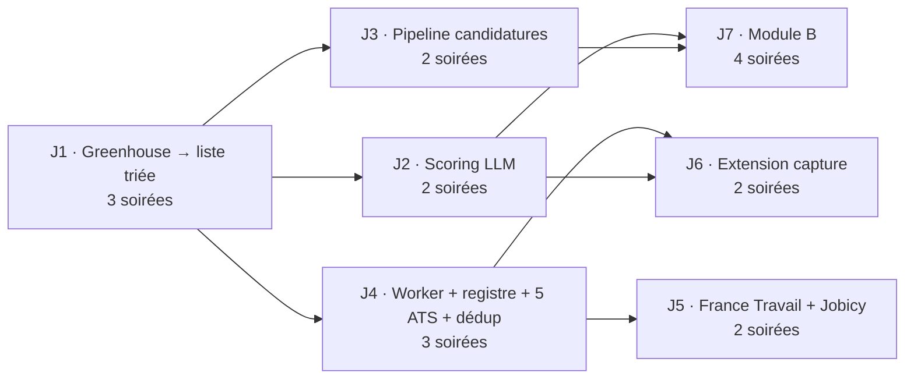

# JobHunt — Roadmap

> Unité d'estimation : **une soirée = 2 à 3 h**, développeur seul. Tout est local : Node, pnpm et PostgreSQL 18 natif (ADR-008).
> Chaque jalon se termine par quelque chose d'**utilisé le lendemain**. Si ce n'est pas le cas, le jalon est mal découpé.

## État au 2026-09-17

**J1 à J7 sont implémentés** (code, 95 tests unitaires, 7 tests d'intégration, build de production OK). Validation effectuée :
- ingestion réelle des 34 boards du registre + Jobicy (≈ 1 300 annonces en 30 s), incrémental (second passage sans modification), dédup inter-sources ;
- base de test PGlite (Postgres WebAssembly), faute de Postgres natif utilisable sur le poste (voir ADR-008) ;
- interface pilotée dans Edge : tri au clavier, candidature, notes, pipeline, ajout de board, lancement d'une source, fiche entreprise, contact, recherche SIRENE, sans erreur navigateur ;
- logique de scoring, capture et brouillons testée avec un faux client LLM.

**Reste à faire par Robin** (ne peut pas être fait sans lui) :
1. Installer PostgreSQL malgré Smart App Control (ADR-008), puis créer la base et `pnpm db:migrate`.
2. Créer `.env` (copie de `.env.example`) : `DATABASE_URL`, `ANTHROPIC_API_KEY`, `CAPTURE_TOKEN`.
3. Premier vrai passage LLM : **évaluer le scoring sur 20 offres** (J2) et ajuster le barème (→ `scoring.v2`).
4. France Travail : créer l'application sur francetravail.io, renseigner les identifiants, activer les trois sources `france_travail:*` et lever les `[À VÉRIFIER]` de SOURCES.md.
5. Charger l'extension dans Chrome (`apps/extension/README.md`).

## Vue d'ensemble

Total : environ **18 soirées**. Ordre recommandé : J1 → J2 → J3 → J4 → J5 → J6 → J7. J2 et J3 sont interchangeables : si Robin postule déjà beaucoup, faire J3 d'abord.

---

## J1 — Une source, un filtre, une liste triée (3 soirées)

**Résultat** : `pnpm ingest`, puis `http://127.0.0.1:3000` affiche les offres des boards Greenhouse choisis, filtrées, triées par `rule_score`. Robin marque chaque offre « intéressé » ou « écarté ».

**Pourquoi Greenhouse** : l'endpoint est public et sans authentification, le JSON est propre (`content=true` donne la description) et le mapping trivial. Beaucoup de scale-ups tech l'utilisent. Remotive a été écarté pour J1 : son flux est mondial et majoritairement hors France, donc son rendement est faible avec le critère « France uniquement ».

**Soirée 1 — Socle**
- [ ] `winget install PostgreSQL.PostgreSQL.18`, `bin` dans le `PATH`, rôle et base `jobhunt`, `DATABASE_URL` dans `.env`.
- [ ] `pnpm-workspace.yaml`, `biome.json`, `tsconfig.base.json` (strict), `.env.example`.
- [ ] `packages/core` : `env.ts` (zod), client `postgres`, schéma Drizzle **minimal** (`companies`, `sources`, `jobs`, `job_clusters`), première migration avec `pg_trgm`.
- [ ] `profile/boards.json` : 5 à 10 tokens Greenhouse d'entreprises FR remote-friendly, choisis par Robin et testés avec `curl`.

**Soirée 2 — Ingestion + filtre**
- [ ] Adaptateur `greenhouse` (`fetch` + `normalize`) et fixture JSON réelle.
- [ ] `normalize/*` : `htmlToText`, `detectRemote`, `detectContract`, `detectSeniority`, `normalizeTitle`, `normalizeCompanyName`.
- [ ] `filter` + `profile/criteria.ts` + `rule_score`.
- [ ] `ingest.runSource` (upsert, cluster 1:1, clôture) et script `pnpm ingest`, qui exécute toutes les sources activées, **sans cron**.
- [ ] Tests Vitest : `normalize` sur la fixture, règles de filtre sur 10 titres types.

**Soirée 3 — UI**
- [ ] `create-next-app` (Next 16, Tailwind 4), `transpilePackages`, écoute sur `127.0.0.1`.
- [ ] `/` : tableau des clusters `passed`/`new` triés par `rule_score`, lien vers l'offre.
- [ ] `/jobs/[id]` : description + raisons du filtre.
- [ ] Server action `setTriage` + raccourcis `i`/`x`.

**Hors J1, volontairement** : cron, LLM, dédup inter-sources (une seule source), pipeline, vue des rejetées. Les clusters sont créés en 1:1 dès J1 pour éviter une migration de données plus tard.

**Dépendances** : aucune.

---

## J2 — Scoring LLM (2 soirées)

**Résultat** : chaque offre filtrée a un score, une justification, des red flags et un hook. L'Inbox est triée par score et masque les verdicts éliminatoires.

- [ ] Table `llm_scores`, colonnes `score_status` et `best_score`.
- [ ] `scoring/schema.ts`, `prompts/scoring.v1.md`, `profile/cv.md` (CV converti en Markdown).
- [ ] `scorePending()` : cache, `messages.parse` + `zodOutputFormat`, retry unique, états d'échec.
- [ ] Commande `pnpm score` ; `pnpm ingest` l'enchaîne automatiquement.
- [ ] UI : `ScorePanel`, `ScoreBadge`, bouton « rescorer », masquage selon les verdicts.
- [ ] **Évaluation manuelle** : scorer 20 offres, vérifier que l'ordre correspond au jugement de Robin, ajuster le barème (→ `scoring.v2` si nécessaire).

**Dépendances** : J1.

---

## J3 — Pipeline de candidatures (2 soirées)

**Résultat** : chaque candidature a un statut, des dates, des notes et une date de relance. La nav affiche « N relances dues ».

- [ ] Tables `applications` et `application_events`.
- [ ] Actions `createApplication`, `updateApplicationStatus`, `addApplicationNote`, `setNextAction` ; calcul automatique de `next_action_at`.
- [ ] `/interesting`, `/pipeline`, `ApplicationCard` dans le détail.
- [ ] Saisie d'une candidature **hors outil** (formulaire libre : entreprise + URL). Robin postule aussi ailleurs, et le pipeline doit être complet. Une `application(kind=job)` sans cluster → **ajuster le CHECK** : `cluster_id` OU `external_url`.

**Dépendances** : J1.

---

## J4 — Worker planifié, registre, ATS supplémentaires, dédup (3 soirées)

**Résultat** : l'ingestion tourne toute seule. Robin ajoute une entreprise en collant l'URL de sa page carrières.

- [ ] `apps/worker` : `croner` (`protect: true`), fenêtres à 7 h, 12 h, 17 h et 22 h plus une au démarrage, `worker_heartbeat`, arrêt propre ; `pnpm dev` lance web et worker.
- [ ] `source_runs`, verrou `running_since`, backoff, désactivation sur 404, planchers d'intervalle ; `HttpClient` (retry, throttle) ; ingestion par lots.
- [ ] `pnpm db:backup` (`pg_dump`) et date de la dernière sauvegarde dans l'UI.
- [ ] Adaptateurs `lever` (global + EU), `ashby`, `smartrecruiters`, `recruitee`, `teamtailor` (RSS), chacun avec sa fixture réelle.
- [ ] `sources/detect.ts` + `/sources` (ajout par URL, test, activation, « lancer maintenant », historique des runs).
- [ ] Dédup niveau 2 (clé + trigram) et action `mergeClusters`.
- [ ] `/rejected` + « repêcher ».

**Dépendances** : J1. Workable n'est pas dans la liste : son endpoint public n'a pas pu être vérifié (voir SOURCES).

---

## J5 — France Travail + Jobicy (2 soirées)

**Résultat** : le volume FR arrive, sans doublonner les offres déjà vues.

- [ ] Compte francetravail.io + application ; OAuth2 client credentials avec token mis en cache jusqu'à expiration.
- [ ] Adaptateur `france_travail` : curseur de dates, pagination `range`, découpage si l'index 3000 est atteint, plusieurs configurations (`motsCles` react / next.js / typescript + `typeContrat=CDI`).
- [ ] Adaptateur `jobicy` (`geo` adapté, `industry=engineering`, `tag`).
- [ ] Liste d'exclusion d'entreprises (ESN, régie) dans `criteria.ts`, alimentée par ce qui remonte.
- [ ] **Mesure** après une semaine : offres passées par source (`/sources`). Décider du sort de Remotive, RemoteOK, WWR et Adzuna (voir « Reporté »).

**Dépendances** : J4 (worker, HttpClient, dédup inter-sources indispensable ici).

---

## J6 — Extension de capture (2 soirées)

**Résultat** : sur une offre LinkedIn ou WTTJ, un clic → l'offre est dans JobHunt, scorée, en moins de 10 s.

- [ ] `POST /api/capture` + `GET /api/health`, `CAPTURE_TOKEN`.
- [ ] `core/capture/extract.ts` (extraction LLM structurée) → même pipeline, filtre en mode conseil.
- [ ] `apps/extension` :
  - `manifest.json` (MV3, `activeTab`, `scripting`, `storage`, `host_permissions` sur `127.0.0.1:3000`) ;
  - page d'options (URL + token) ;
  - clic → `chrome.scripting.executeScript` renvoie le titre, l'URL, et la sélection sinon `document.body.innerText` ;
  - notification avec le score et un lien vers la fiche.
- [ ] Mode sélection : si Robin a sélectionné le panneau de l'offre, seul ce texte est envoyé (utile sur la vue liste + détail de LinkedIn).

**Dépendances** : J2 (scoring), J4 (pipeline d'ingestion commun).

---

## J7 — Module B : candidatures spontanées (4 soirées)

**Résultat** : une liste d'entreprises cibles, des contacts génériques vérifiés, un brouillon personnalisé prêt à envoyer depuis Outlook, et le suivi des relances.

- **Soirée 1** : `companies` (colonnes B), `contacts` (champs RGPD), `/companies`, promotion depuis le module A, ajout manuel, enrichissement par recherche-entreprises (SIREN, NAF, effectif).
- **Soirée 2** : `core/contacts` (robots.txt, 6 pages, extraction, liste blanche générique, MX), `discoverContacts`, ajout manuel de contact nominatif avec source obligatoire.
- **Soirée 3** : `core/outreach` (`outreach.v1.md`, structured outputs, pied RGPD automatique), `DraftEditor`, `mailto`/copier, « marqué envoyé » → `applications(kind=spontaneous)`.
- **Soirée 4** : suppression et opposition, purge, `pnpm db:purge-contacts`, relances dans `/pipeline`, et test de bout en bout sur 5 entreprises réelles.

**Dépendances** : J3 (pipeline), J2 (client LLM et conventions de prompts).

**Garde-fou** : si, après J6, Robin a assez d'offres pertinentes (plus de 10 par semaine à score ≥ 70), **J7 peut ne jamais être fait**. C'est un résultat acceptable.

---

## Reporté volontairement

| Sujet | Pourquoi pas maintenant | Signal concret pour s'y remettre |
|---|---|---|
| Déploiement (Railway / VPS) + authentification | Local suffit, même PC éteint la nuit : la fenêtre de démarrage rattrape tout (confirmé par Robin le 2026-09-17). | Robin rate des offres parce que le PC était éteint plusieurs jours, **ou** veut trier depuis son téléphone. Pour le premier signal seul, commencer par le plus léger : `pnpm ingest` planifié dans GitHub Actions ou worker seul sur Railway, sans auth puisqu'il n'expose rien. `[À VÉRIFIER : quota gratuit d'Actions sur un repo privé]` |
| Lancement automatique au démarrage de Windows | Une commande à taper. | Worker oublié plus d'une fois par semaine (heartbeat périmé à l'ouverture de l'UI). |
| Base hébergée (Neon, étudiée dans ADR-008) | Tout est local ; aucun besoin d'accès extérieur. | Déploiement du worker ou de l'app, ou besoin d'un second poste. |
| BullMQ + Redis | Une centaine de runs par fenêtre, un seul consommateur (voir PLAN §6.3). | Fenêtre régulièrement plus longue que 30 min, **ou** besoin de plusieurs workers. |
| TanStack Query / store client | Aucun état client à synchroniser. | Besoin d'une UI qui se met à jour sans navigation (ex. progression live d'un run). |
| `cacheComponents` / React Compiler | Rien à mettre en cache ni de problème de rendu mesuré ; le Compiler rallonge les builds (Babel). | Interaction lente mesurée dans la liste (plus de 1 000 lignes). |
| Remotive, RemoteOK, WeWorkRemotely | Flux mondiaux, surtout US : faible rendement avec « France uniquement ». | Après J5, moins de 10 offres par semaine à score ≥ 70. Commencer par Remotive (adaptateur d'une heure). |
| Adzuna | Agrégateur qui recoupe France Travail ; quotas serrés (250 appels/jour). | Même signal que ci-dessus, **et** France Travail rate des offres vues ailleurs. |
| Workable | Endpoint public non vérifié. | Au moins 3 entreprises cibles sur Workable. Vérifier alors l'endpoint (SOURCES). |
| Dédup sémantique (embeddings) | Clé + trigram + fusion manuelle suffisent a priori. | Plus de 3 fusions manuelles par semaine. |
| Batch API Anthropic (−50 %) | Coût déjà inférieur à 1 $ par semaine. | Coût LLM supérieur à 5 $ par mois (visible sur `/sources`). |
| Prompt caching Anthropic | Préfixe sous le minimum de 4 096 tokens de Haiku 4.5. | Préfixe système au-delà de 4 096 tokens (CV enrichi, exemples). |
| Envoi d'emails depuis l'app | Délivrabilité, OAuth, tentation du volume. | Plus de 20 candidatures spontanées par semaine **et** le copier-coller devient le goulot. |
| Génération de lettres de motivation (module A) | Le `hook` suffit ; une lettre générée se voit. | Des ATS qui exigent une lettre sur plus de 30 % des candidatures. |
| Export CSV / statistiques | Aucun besoin exprimé. | Besoin de justifier les démarches (ex. auprès de France Travail). |
| Découverte automatique d'entreprises (SIRENE à grande échelle, listes externes) | Faible signal, beaucoup d'ESN (PLAN §9.1). | Le registre stagne sous 30 entreprises malgré le rituel hebdomadaire. |
| Migration Drizzle 1.0 | 1.0 encore en RC le 2026-09-17. | 1.0 stable publiée : `drizzle-kit up` + import `defineRelations` si l'API relationnelle est utilisée (elle ne l'est pas, voir ADR-001). |
| typescript-eslint / lint typé | TS 7 n'a pas encore d'API JS (prévue en 7.1). | TypeScript 7.1 publié **et** un besoin de règles typées que Biome ne couvre pas. |
